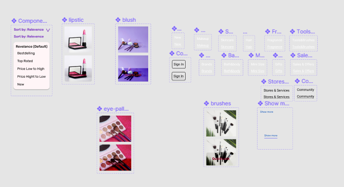

# dsgn270-a5

## Maryam Khan

## Figma Prototype
- [Figma](https://www.figma.com/file/ILagBqTY4k8LWCr0wqRnt3/dsgn270-a5?node-id=42%3A136)
- [GH repo](https://github.com/maryambkhan/dsgn270-a5)
### Code Journal

- I have copied the landing page from dsgn270-a4 and
   started new project dsgn270-a5.

- Plan:
    - Components:
        - Global nav-bar
        - Local nav-bar
        - Sign in button
        - Show more button
        - Card
- I have created a home page and atteched all the components to it
- Created second page Navigating to `new` page and this page has all the 
  available new products i wanted to add more products to it like when i click 
  see more then i can see more products but i cant figure out how to add two properties 
  to one component
- It looks clean and simple i like it, i CAN still see some silly mistakes
  need more practice but i this looks nice
- On third page `makeup` i posted cards with more makeup products and a poster with 
  call to action.
- I made more components on the way as i needed them `jessica's demo` helped me with creating these 
  little components and re using them.
- I wanted to go for simple design and make the site easy and accessable for user i tried to use more color
  to make site colorfull as it is a cosmetics website. I think did not overdo with the colors
- Mostly i wanted to use as much as  different prototype i could use

- Creating nav bar was so hard i had to do same thing over and over so many time
  i wish i can find something easy then this

### Attributions

- [pexels](https://www.pexels.com/search/cosmetics/)
- [Sephora](https://www.sephora.com/ca/en/)